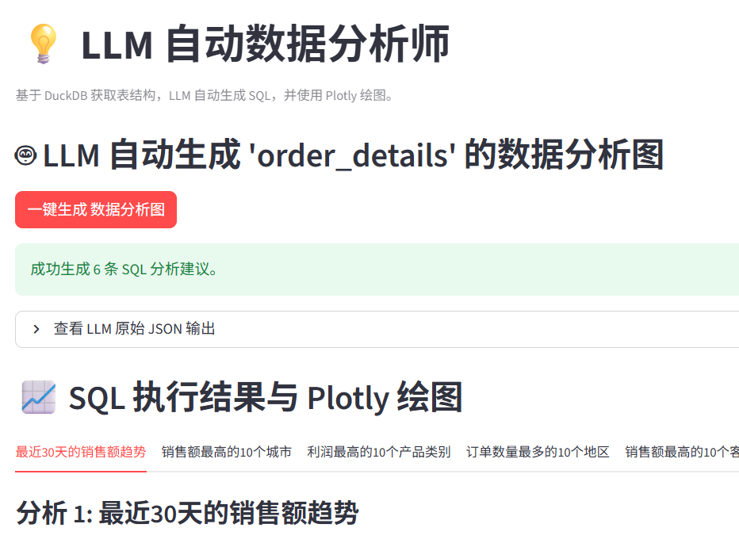
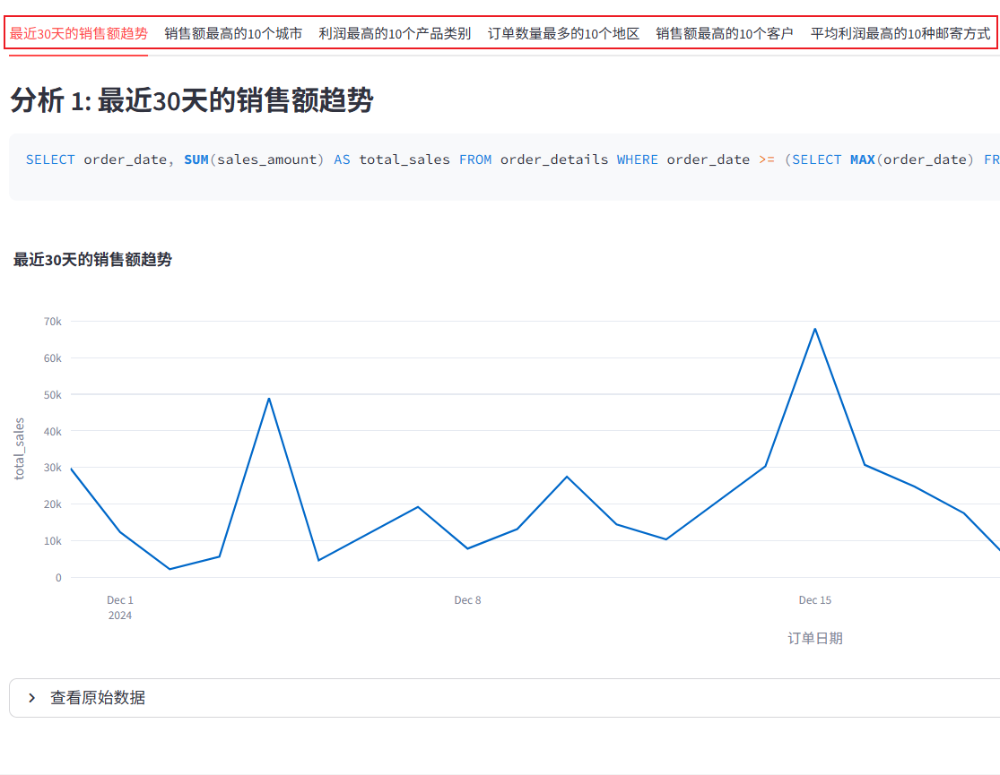
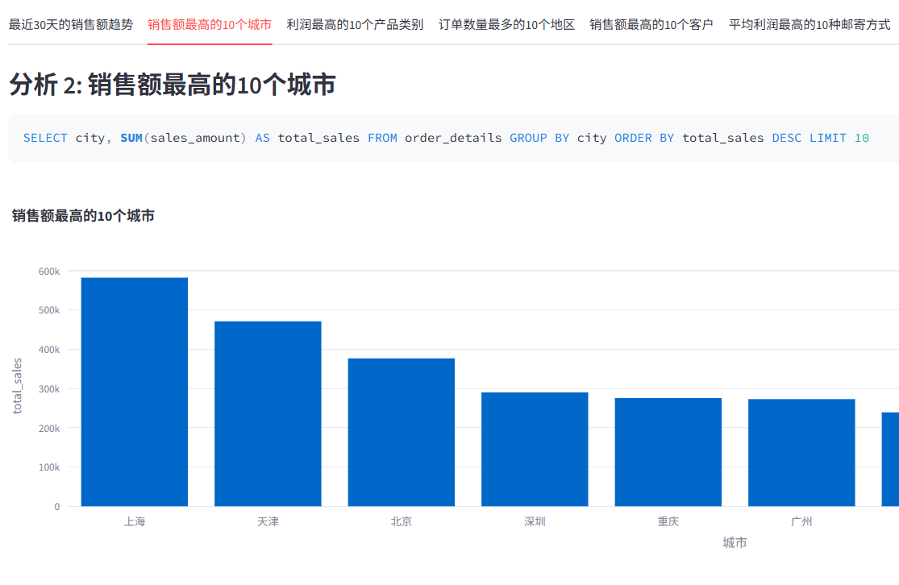

# LLM 中文表格自动数据分析师
## 主要功能
1. **自动（LLM）加载** 多个**中文列名**xlsx文件到Duckdb数据库，通过LLM自动生成表的英文列名，并存储“中文列名-英文列名”对应关系到`table_meta` 元数据表
2. **自动（LLM）** 对加载的中文表格数据生成多种分析图表（plotly）







## 技术和架构说明（仅在Windows下测试通过）
- xls数据文件以请放入 `input_xls` 目录
  执行下面命令加载数据到 `db\salesrag.duck` 

  ```python
  python.exe .\db\xls_loader.py    
  ```
  **错误说明**:
  第一次运行可能会出现以下错误，忽略，再次运行程序即可，可能是xls文件导致的问题。
    ```text
    处理失败 商城详细销售数据.xlsx: Expecting ':' delimiter: line 96 column 10 (char 1552)
    ```
  
- 大模型使用的是本地的**Ollama**的 `qwen3:4b` 模型，请自行下载搭建
- 在 Windows 平台运行通过
- 使用下面命令运行界面交互程序 
  ```python
    streamlit.cmd run .\frontend\app.py
  ```
      